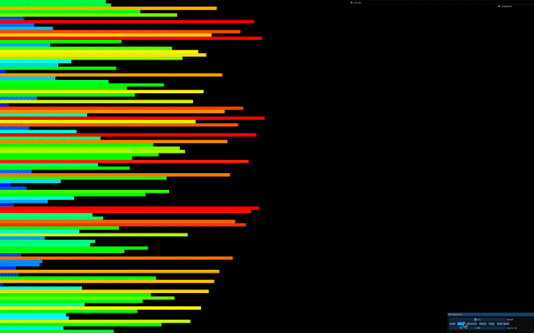

# Push_swap - 42 Project


###### I’ve used [push swap visualizer](https://github.com/o-reo/push_swap_visualizer?tab=readme-ov-file/) in order to get this beautiful visualization

## Introduction

The **Push_swap** project at 42 is designed to challenge students in algorithmic thinking and optimization. The goal is to sort a list of integers using a set of predefined operations on two stacks, ensuring efficiency in terms of the number of moves used.

## Concept

Push_swap requires implementing a sorting algorithm using $\color{crimson}{\textbf{two stacks}}$ ($\color{Darkorange}{\textbf{stack A}}$ and $\color{LightSkyBlue}{\textbf{stack B}}$) and a set of operations. The challenge is to create an efficient sorting solution with as few operations as possible.

## Mandatory Requirements

  - Implement a program that sorts integers using two stacks.

  - Allowed operations:

    - ```sa``` (swap A) – Swap the first two elements of stack A.

    - ```sb``` (swap B) – Swap the first two elements of stack B.

    - ```ss``` – Swap the first two elements of both stacks simultaneously.

    - ```pa``` (push A) – Push the top element of stack B onto stack A.

    - ```pb``` (push B) – Push the top element of stack A onto stack B.

    - ```ra``` (rotate A) – Shift all elements of stack A up by one.

    - ```rb``` (rotate B) – Shift all elements of stack B up by one.

    - ```rr``` – Rotate both stacks A and B.

    - ```rra``` (reverse rotate A) – Shift all elements of stack A down by one.

    - ```rrb``` (reverse rotate B) – Shift all elements of stack B down by one.

    - ```rrr``` – Reverse rotate both stacks A and B.

  - The program must handle:

    - Different input sizes efficiently.

    - Duplicates and invalid inputs.

    - Edge cases such as already sorted lists.

## Bonus Features

The bonus part extends the project with:

  - Implementing a **checker program** that verifies if a given sequence of operations correctly sorts the stack.

  - Optimizing the sorting algorithm for efficiency in terms of the number of operations.

## Implementation Details

### Sorting Algorithm

  - For **small stacks** (≤3 elements), a hardcoded sorting solution can be used.

  - For **medium stacks** (~5 elements), a combination of push and swap operations is required.

  - For **larger stacks**, efficient algorithms such as $\color{YellowGreen}{\textbf{quick sort}}$, $\color{YellowGreen}{\textbf{radix sort}}$, or $\color{YellowGreen}{\textbf{merge sort-inspired methods}}$ must be used to minimize operations.

### Error Handling

  - The program must handle incorrect inputs gracefully (e.g., **non-numeric values**, **duplicates**, **out-of-range integers**).

  - Proper memory management is required to prevent leaks.

## Compilation and Usage

To compile the project, use:
```console
cc -Wall -Wextra -Werror push_swap.c push_swap_utils.c -o push_swap
```
To run the program:
```console
./push_swap 4 3 2 1
```
To use the checker bonus:
```console
./push_swap 4 3 2 1 | ./checker 4 3 2 1
```
## Common Pitfalls

  - $\color{crimson}{\textbf{Using inefficient algorithms}}$ that result in too many operations.

  - $\color{crimson}{\textbf{Not handling edge cases}}$ like sorted input or repeated numbers.

  - $\color{crimson}{\textbf{Failing to implement the correct logic}}$ for each operation.

  - $\color{crimson}{\textbf{Memory leaks}}$ due to improper handling of dynamically allocated memory.

## Conclusion

The **Push_swap** project is an excellent exercise in algorithmic thinking and optimization. It encourages students to explore different sorting strategies and analyze their efficiency, reinforcing both theoretical and practical programming skills.
